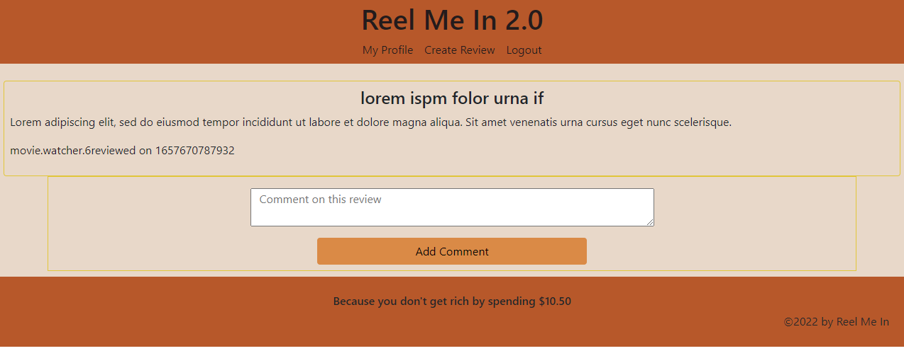

# Reel-Me-In-2.0

## Table of Contents

1. [What is app for?](#what)

1. [How to use the app](#how)

1. [How to report issues](#issues)

1. [How to make contributions](#contribute)

1. [Link to Deployed Application](#link)

### What is App for? <a name="what"></a>
Reel-Me-In was developed to allow the user to post comments about movies and decide if the movie was worth paying $10.50 a ticket to see in cinemas. It allows users, once logged in, to post movie reviews. Other users may comment on those reviews agreeing or disagreeing. This gives the reader a full picture of how the public feels about the movie. If the user is not logged in, they may still see the reviews but cannot post or comment. Reel-Me-In-2.0 was created using:
* Node.js
* Express
* Mongodb
* Mongoose
* React
* Bootstrap
* GraphQL


### How to Use the App: <a name="how"></a>

Clone from Github and cd into the directory
```bash
npm install
npm run seed
npm run develop
```

### How to Report Issues: <a name="issues"></a>
Contact any of the authors:
|Name   | Github    |
| ----- | -------   |
|Sergieo | SergieoL |
|Brian  |  brian-000 |
|Aisha | Akimpson |
|Markeice | Markeicegreen16 |
|Mika | Mikak02 |

### How to Make Contributions <a name="contribute"></a>
Please contact authors for collaboration

### Link <a name="link"></a>
[Link to deployed Application](link-to-heroku)

